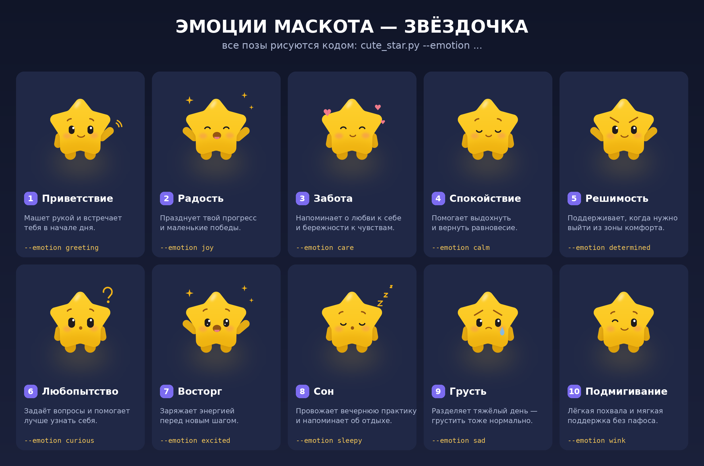
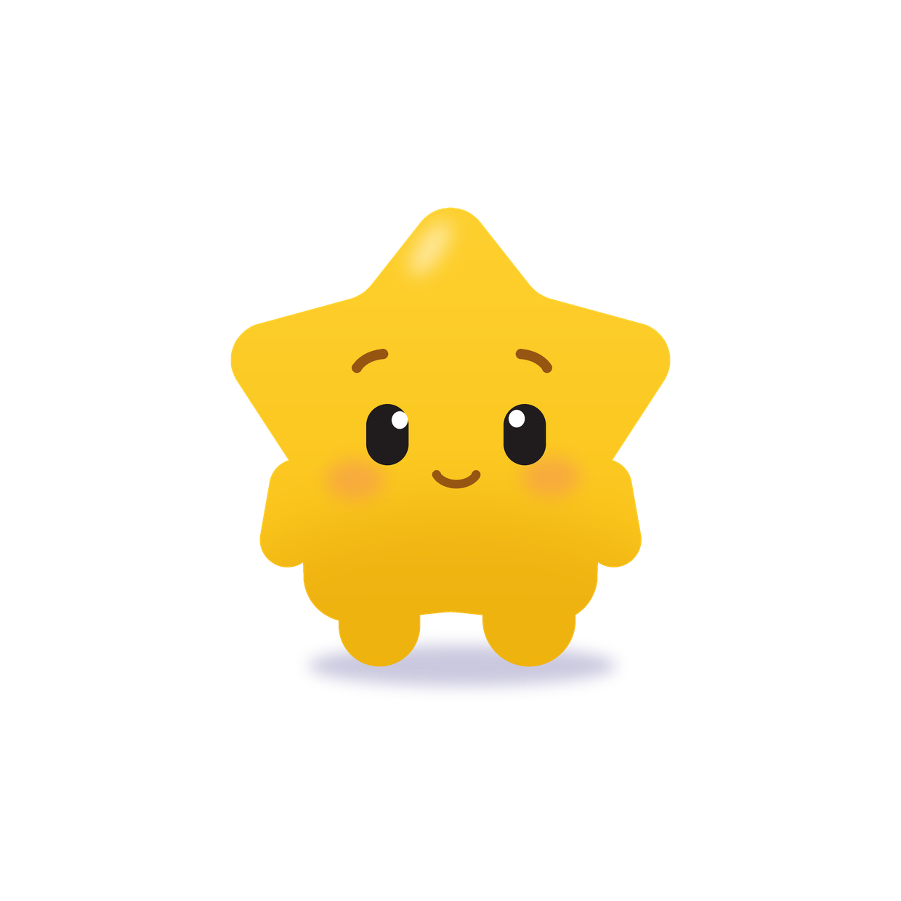
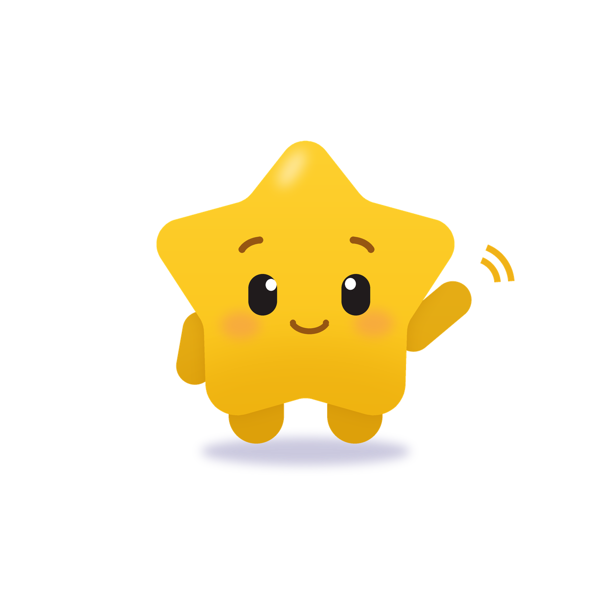

# Звёздочка на Python

`cute_star.py` рисует милого персонажа-звёздочку одним скриптом на Pillow:
скруглённая пятиконечная звезда с градиентом, бликом, ручками-ножками,
тенью на полу и лицом (глаза с бликами, брови, румянец, улыбка).

Сглаживание — суперсэмплингом: всё рисуется в 3 раза крупнее и уменьшается
через LANCZOS.

Пропорции — как у персонажа с референса: верхний луч и два боковых, снизу
широкие «бёдра» с неглубокой выемкой, ручки-культяпки по бокам и две
короткие ножки. Тело, руки и ноги — один силуэт под общим градиентом,
поэтому руки не выглядят отдельной деталью, приклеенной к корпусу. Чтобы
конечности при этом не сливались, их видимая часть чуть темнее корпуса, а
вдоль края тела на них ложится мягкая контактная тень — силу задаёт
`--limb-depth none|soft|medium|strong`.

## Запуск

```bash
pip install pillow
python3 cute_star.py                       # -> star.png, 1240x1240

# набор иконок для приложения: прозрачный фон, обрезка по фигуре, без тени
python3 cute_star.py --out icon.png --size 1024,512,256,180 \
        --bg none --crop --no-shadow
```

```bash
# поза приветствия: машет поднятой рукой
python3 cute_star.py --out star_wave.png --pose wave
```

Флаги: `--out`, `--size` (одно число или список через запятую — к именам
добавится суффикс размера), `--bg white|none`, `--crop`, `--no-shadow`,
`--limb-depth`, `--pose idle|wave`.

## Эмоции

Десять готовых состояний — поза рук, форма глаз/бровей/рта и реквизит
(сердечки, zzz, искры, слеза, вопрос) задаются одним флагом:

```bash
python3 cute_star.py --out star.png --emotion joy
python3 make_emotions.py --export emotions   # лист emotions.png + PNG на каждую
```

`greeting`, `joy`, `care`, `calm`, `determined`, `curious`, `excited`,
`sleepy`, `sad`, `wink` — см. `emotions.png`.



Как устроен персонаж и что где менять — `MASCOT.md` и схема `anatomy.png`
(перерисовывается через `python3 make_anatomy.py`).



